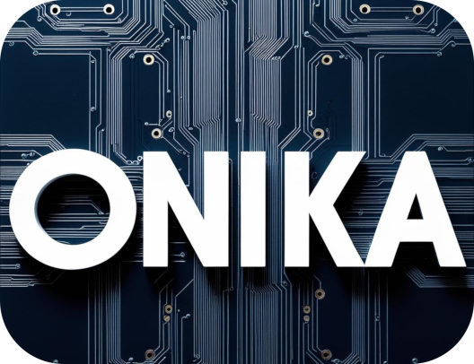

# Onika

Onika (Object Network Interface for Knit Applications), is a component based HPC software platform to build numerical simulation codes.

## Documentation

Onika is the foundation for the exaNBody particle simulation platform but is not bound to N-Body problems nor other domain specific simulation code.
Existing applications based on its building blocks include Molecular Dynamics, particle based fluid simulations using methods such as Smooth Particle Hydrodynamics (SPH) or rigid body simulations using methods such as Discrete Element Method (DEM).
It uses industry grade standards and widely adopted technologies such as CMake and C++20 for development and build, YAML for user input files, MPI and OpenMP for parallel programming, Cuda and HIP for GPU acceleration.

